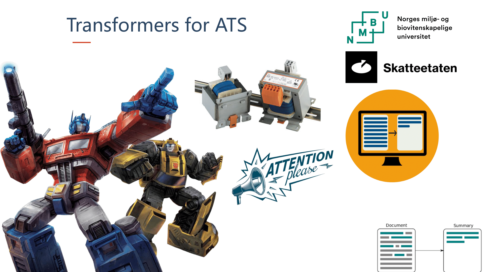

# Automatic Text Summarization and Translation (ATS) with Transformers (T5), HuggingFace, and OpusMT



This repository contains the master thesis project for implementing an Automatic Text Summarization (ATS) system with transformers T5, HuggingFace, and OpusMT.

## Table of Contents

- [Overview](#overview)
- [Installation](#installation)
- [Folder Structure](#folder-structure)
- [Contributing](#contributing)

## Overview

Our work consists of a comprehensive study and implementation of a novel ATS system using state-of-the-art transformer models like T5, along with HuggingFace and OpusMT for efficient natural language understanding, processing, and translation. The ultimate goal is to create an effective, high-performing text summarization system that is both abstractive and efficient.

## Installation

1. Clone this repository:
    ```
    git clone https://github.com/[username]/[reponame].git
    ```

## Folder Structure

- `data_exploration`: Scripts and notebooks for exploring and understanding the dataset can be found here.
- `datasets`: This directory houses the training, validation, and test splits of the CNN/Daily Mail dataset.
- `evaluation`: This directory contains evaluation scripts for calculating ROUGE-1 scores and other evaluation metrics.
- `decoding_hyperparameter_search`: This directory holds scripts to determine the optimal hyperparameters for the model.
- `nmt`: This directory contains scripts related to Neural Machine Translation (NMT).
- `plots`: This directory contains various plots and figures generated during the project.
- `t5_summarization`: Contains scripts related to T5 summarization.

## Contributing

We appreciate contributions of all kinds. If you would like to contribute to this project, please fork the repository and submit a pull request.

## License

This project is licensed under the MIT License - see the [LICENSE.md](LICENSE.md) file for details.

## Authors

- [Jørgen Navjord](https://github.com/navjordj)
- [Jon-Mikkel R. Korsvik](https://github.com/jkorsvik)

For any questions or suggestions, feel free to open an issue or reach out to us.
